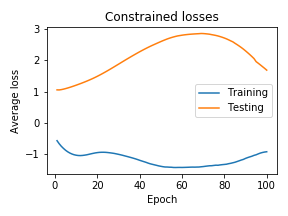

# Constrained Neural Nets Workbook

Something vaguely abstract-y will go here, _e.g._

We review a method of applying multiple hard equality constraints to neural network training influenced by dynamical systems and differential geometry. We slightly modify the method to better allow for use with neural networks. Specifically, we show that the algorithm is equivalent to a particular Lagrange multiplier system, which allows for the construction of a modified loss function and for the application of standard backpropagation. We evaluate the speed of the algorithm in light of the known theoretical guarantees and propose further modifications which trades off some of the guarantees for a several orders of magnitude increase in speed. Experimentally, we evaluate the performance and computational efficiency of the original algorithm and its modification against both unconstrained and “soft-constrained” baselines on a simple toy problem which allows for detailed investigation of the convergence properties. Further, we examine multiple constraints in the form of linear and non-linear partial differential equations (PDEs), such as the linear Helmholtz equation and a non-linear differential form of the Pythagorean equation. We show that while the outputs of the constrained models do often seem qualitatively better and are not as prone as the soft-constraint method to collapsing to a small subspace of the valid constraint space, the theoretical guarantees of convergence do not seem to be practically evident. Lastly, we discuss the implication of the computational complexity on practical application and offer suggestions for the implementation and possible future improvements.

# Constrained Optimization of Neural Networks

Here is where the description of Experiment A will go. Here is an example of using MathJax:

$$ mean = \frac{\displaystyle\sum_{i=1}^{n} x_{i}}{n} $$

# Projection of Neural Networks to Constraint Manifolds

Here is where the description of Experiment B will go. Here is an example plot:

 

